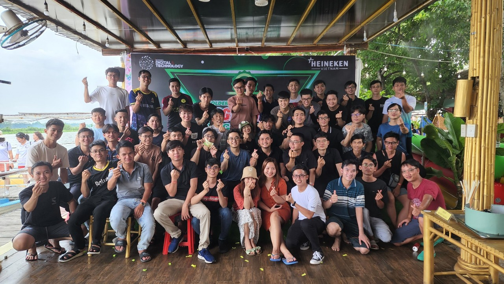

    <a href="https://github.com/NguyenTheLuan">
        

    </a>
    <h3>My infomation:</h3>
    
- I'm <code>22 years old</code>
     - I'm <code>a Frontend developer</code>
      - Now, I'm <code>a R&D Engineer in SAMSUNG SEHC VIETNAM</code>

    

    
<code>My group R&D in SEHC Corporation</code>

<h3>About me</h3>
<table>
  <tr>
    <th>My skill</th>
    <th>Experience</th>
    <th>Description</th>
  </tr>
  <tr>
    <td>Photoshop, Camtasia, Ableton and Wordpress</td>
    <td>More 1 years</td>
    <td>I've worked for <b>Real Estate company</b> when I'm a second student in college
    </td>
  </tr>
  <tr>
    <td>DOM</td>
    <td>More 1 years</td>
    <td>HTML, CSS/SCSS, JS (or webpack with TS), Figma
    </td>
  </tr>
  <tr>
    <td>ReactJS</td>
    <td>Near 1 year</td>
    <td>React, Hook, Redux, 3rd libraries</td>
  </tr>
  <tr>
    <td>Angular</td>
    <td>Near 5 months</td>
    <td>OOP, ST plugin, CoBa systems, IOT, mobile app</td>
  </tr>
</table>

    
    

    <!-- connect -->
    

        
            <b>
                
                Connect with me 🤝
            </b>
        
         
        
            
            
            
            
        
    

    <!-- visit -->
    

        <b>❤️ Visit github</b>
         
        </img>
    

